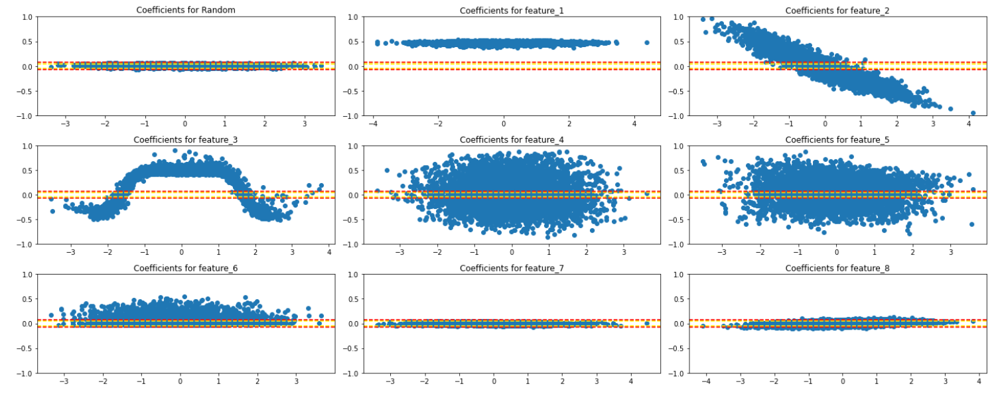

# glmnet

## Introduction
This is an implementation of the LocalGLMnet model suggested
by Ronald Richman and Mario W&uuml;thrich in their July 2021 paper
"*LocalGLMnet: interpretable deep learning for tabular data*". The idea behind 
this model is to create a framework for predictive analysis
on tabular data which combines the powerful modelling capabilities of 
feed-forward neuarl networks with the interpretability of GLMs.

## Using the package
The LocalGlmNet class essentially forms a wrapper around the basic keras
model, providing a convenient set of plotting functions to allow users to 
carry out feature importance and feature interaction analysis - the example
notebooks in the notebook directory provide more details on how this functionality can be used.
The .py files can be converted to a standard notebook using the 
[Jupytext package](https://github.com/mwouts/jupytext).

## Continuous variables

### Distribution of attention

The first plot that we can look at is the distribution of the attention beta weights against the actual
values of the different variables. This allows us to see how each feature impacts the final prediction, and
how this evolves as the value of the feature changes. 

We add horizontal lines to show confidence intervals for significance at the 95%, 99% and 99.9% level. These 
are based on the values observed for a totally random feature with no relation to the target variable whatsoever.

### Feature interactions

By computing the derivative of each attention beta weight with respect to each of the variables, we can see
the way in which the different variables interact with one another.

**TODO: add chart for feature interactions**

### Feature importance

Finally, we can take the mean attention beta weight to be the standalone "importance" of a given feature. Again,
we add a threshold based on the "importance" of a totally random variable.

## Categorical variables

**TODO: add in charts for categorical variables**

## Original paper

A copy of the original paper can be found 
[here](https://arxiv.org/abs/2107.11059).
